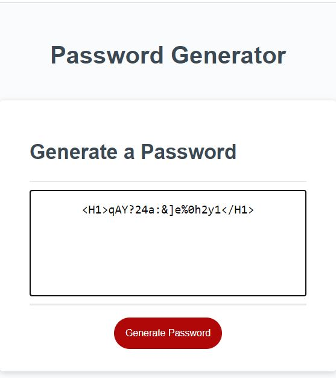

# 03 JavaScript: Password Generator

## Description

 generate random passwords  HTML and CSS powered by JavaScript code, HTML and CSS

 ## Run
To view this project, click [Password Generator](https://klhi3.github.io/password-generator/)

## Features
This creates s password with conditions provided by user:  
combined  of Uppercase charaters, Lowercase characters, Numbers and Symbols 

## Portfolio
  

    

:copyright:klhi3
